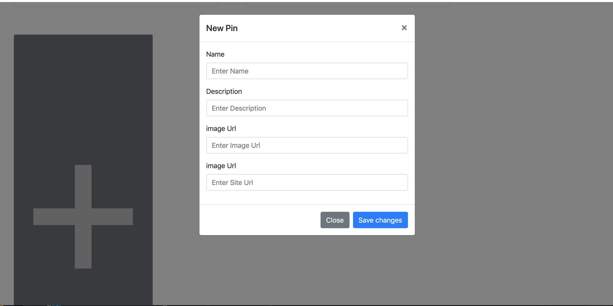

# pinterest

## Description
An imitation of the website Pinterest.

## Technologies Used
Firebase, Webpack, JQuery, Javascript, SCSS, HTML

## Screenshots

Board Screen

Add a board

Add a board modal

pins

Add a pin modal

Edit pin modal.  Info is pre-populated into the modal.